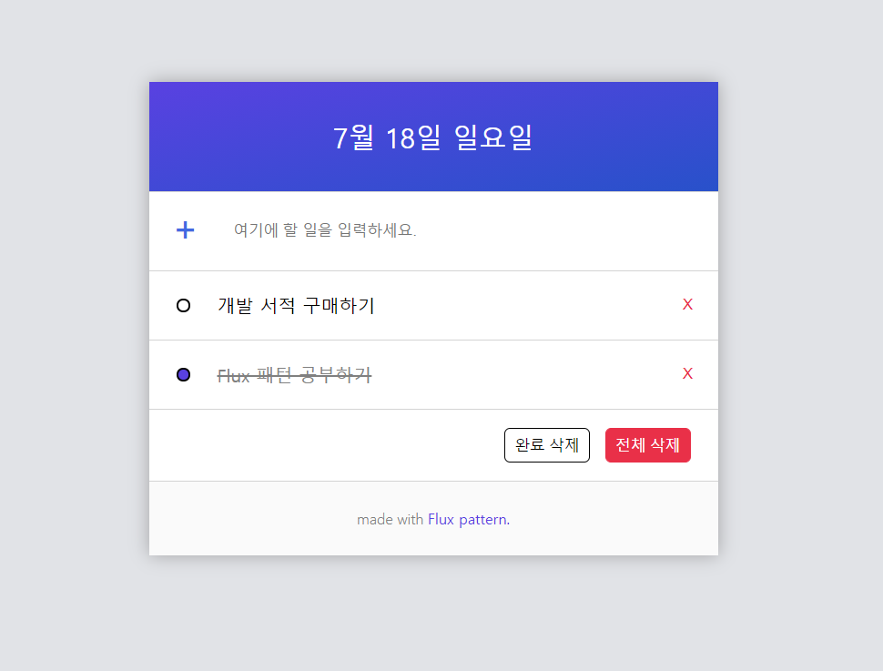

# Flux-todo
Flux패턴을 공부하고, 해당 패턴을 이용하여 todo 리스트를 구현해보았습니다.
[여기](https://yes-xodnd.github.io/flux-todo)에서 데모를 실행해볼 수 있습니다.




## 파일 구조

```
src/
├ stores/
├ views/
├ action.js
└ flux.js
```

주요 파일구조는 위와 같습니다. Flux 패턴의 네 가지 요소인 디스패처, 스토어, 액션, 뷰에 해당하는 파일 또는 폴더를 생성했습니다. 여러 개의 파일이 있을 수 있는 요소는 폴더로 생성했습니다. `flux.js` 파일에는 디스패처와 스토어 생성 함수를 합쳐 관리하도록 하였습니다.


## Flux 요소 구현 내용

### 디스패처 Dispatcher

- `register` 메소드로 스토어는 디스패처에 등록할 수 있습니다.
- `dispatch` 메소드로 등록된 스토어에 액션을 전달할 수 있습니다.
- 클로저로 구현하여 스토어 목록에 직접 접근하거나 수정할 수 없습니다.
- 객체의 프로퍼티가 변경되지 않도록 `Object.freeze` 를 통해 불변객체로 만들어 반환합니다.
- 애플리케이션 당 하나의 디스패처만 존재해야하기 때문에, 디스패처를 생성하여 export 합니다.

``` js
// src/flux.js
const createDispatcher = () => {
  const stores = [];
  const dispatcher = {
    register(store) {
      stores.push(store)
    },
    dispatch(action) {
      stores.forEach(store => store.dispatch(action));
    }
  };
  return Object.freeze(dispatcher);
}

export const dispatcher = createDispatcher();
```


### 스토어 Stores

- 스토어의 `state` 객체에는 외부에서 직접 접근하거나 수정할 수 없습니다.
  getter로 `getState` 메소드를 제공하며, 항상 사본을 반환합니다.
- `subscribe` 메소드를 통해 컴포넌트들은 스토어 `state`의 변경을 구독할 수 있습니다.
  변경이 있을 때 구독한 컴포넌트들은 리렌더링 됩니다.
- `addReducer` 메소드를 이용해 특정 액션 타입에 반응할 수 있도록 reducer 함수를 등록할 수 있습니다.
  reducer 함수는 항상 첫 번째 인자로 스토어 `state`의 사본을 전달받으며, 변경된 `state` 값을 반환해야 합니다.
- `dispatch` 메소드를 통해 외부(디스패처)에서 액션을 전달받고, 해당하는 reducer 함수를 통해 `state`를 변경할 수 있습니다.

``` js
// src/flux.js
const deepClone = obj => JSON.parse(JSON.stringify(obj));

export const createStore = initState => {
  let state = initState;
  const subscribers = [];
  const reducers = {};
  const emit = () => subscribers.forEach(component => component.render());

  const store = {
    getState() {
      return deepClone(state);
    },
    subscribe(component) {
      subscribers.push(component);
    },
    addReducer(type, reducer) {
      if (reducers[type]) {
        throw new Error(`이미 등록된 Action type입니다. type: ${type}`);
      }

      reducers[type] = reducer;
      return this;
    },
    dispatch(action) {
      if (!reducers[action.type]) {
        return ;
      }

      const reducer = reducers[action.type];
      const newState = reducer(deepClone(state), action);
      state = newState;
      emit();
    }
  };

  return Object.freeze(store);
}
```

- 스토어 생성 함수를 통해 초기화 상태를 정의하고 스토어를 생성한 뒤, 아래처럼 reducer 함수를 등록합니다.
- 반드시 디스패처에 등록해야 액션을 전달받을 수 있습니다.

``` js
// src/stores/mainStore.js
import { createStore, dispatcher } from '../flux.js';

const mainStore = createStore({
  todos: [],
});

mainStore
.addReducer('ADD_TODO', (state, action) => {
  const { todoItem } = action.data;
  state.todos = [ todoItem, ...state.todos ];
  return state;
})
.addReducer('DELETE_TODO', (state, action) => {
  const { id } = action.data;
  state.todos = state.todos.filter(item => item.id !== id);
  return state;
})
// ...
;

dispatcher.register(mainStore);

export default mainStore;
```


### 액션 Actions

- 디스패처에 액션을 전달하는 함수를 정의합니다. 정의된 함수들은 뷰에서 사용됩니다.
- 액션은 `type`과 `data` 프로퍼티를 갖는 단순한 객체입니다.

``` js
// src/actions.js
import { dispatcher } from './flux.js';
const dispatch = dispatcher.dispatch;

export const addTodo = content => dispatch({
  type: 'ADD_TODO',
  data: {
    todoItem: {
      id: '' + Date.now(),
      done: false,
      content
    }
  }   
});

export const clearTodo = () => dispatch({
  type: 'CLEAR_TODO',
});
```


### 뷰 Views

- 뷰는 클래스를 이용해 컴포넌트로 구현했습니다.
- 생성될 때 `HTMLElement`인 `el`을 전달받아 저장합니다.
- `render` 메소드는 새로운 DOM 트리를 생성하고 `el`과 교체하여 업데이트합니다.
  `template`은 문자열 또는 문자열을 반환하는 함수로, `innerHTML`을 통해 새로운 DOM 트리에 삽입됩니다.
- 새로운 DOM 트리의 요소를 선택해 앞에서 정의한 액션 함수를 이벤트리스너로 등록할 수 있습니다.

``` js
import { addTodo } from '../actions.js';

export default class TodoInput {
  constructor(el) {
    this.el = el;
  }

  template = `
	  <button class="button">+</button>
    <input type="text" value="" placeholder="여기에 할 일을 입력하세요."/>
  `;

  render() {
    const root = document.createElement('div');
    root.className = 'todo-input';
    root.innerHTML = this.template;

    const input = root.querySelector('input');
    const button = root.querySelector('button');

    function handleEvent() {
      if (!input.value) {
        alert('내용을 입력해주세요!');
        return ;
      }
      addTodo(input.value);
      input.value = '';
    }

    input.addEventListener('keyup', e => {
      const { key } = e;
      if (key === 'Enter') {
        handleEvent();
      }
    });

    button.addEventListener('click', handleEvent);

    this.el.replaceWith(root);
    this.el = root;
  }
}
```

